<!-- ════════════════════════════════════════════════════════════════════════
     Ali Husnain — GitHub profile
     The section panels are animated SVGs generated by assets/generate.py.
     Edit the copy/palette there and re-run:  python3 assets/generate.py

     NOTE: every  is deliberately wrapped in an <a href="#section">.
     GitHub auto-wraps any un-linked image in a link to the raw file, so
     clicking a panel would otherwise navigate away to the bare SVG.
     ════════════════════════════════════════════════════════════════════════ -->

&nbsp;&nbsp;&nbsp;&nbsp;

<!-- ─────────────────────────────── HERO ─────────────────────────────── -->

<!-- ─────────────────────────────── ABOUT ────────────────────────────── -->

<!-- ─────────────────────────────── STACK ────────────────────────────── -->

  
   
  <i>my daily drivers — everything else is one click away</i>

<b>&nbsp;🎨&nbsp; Frontend</b>

 

  

<b>&nbsp;⚙️&nbsp; Backend</b>

 

  
    
  
  

<b>&nbsp;🤖&nbsp; AI &amp; Integrations</b>

 

  
  
  
  
    
  8+ third-party integrations shipped across payments, data and AI tooling

<b>&nbsp;🗄️&nbsp; Databases &amp; ORMs</b>

 

  
    
  
  

<b>&nbsp;☁️&nbsp; Cloud, DevOps &amp; Tooling</b>

 

  
    
  

<!-- ────────────────────────────── JOURNEY ───────────────────────────── -->

<b>&nbsp;🏢&nbsp; Septem Systems</b> &nbsp;—&nbsp; Full Stack Engineer &nbsp;·&nbsp; <i>Nov 2025 – Present · Full-time · Lahore, Pakistan (On-site)</i>

 

- 🚀 Current role — full-stack delivery with **JavaScript, React.js** and the modern Node.js toolkit
- 🏗️ Building and shipping production features as part of the on-site Lahore engineering team

<b>&nbsp;🏢&nbsp; ILSA Interactive</b> &nbsp;—&nbsp; Software Engineer &nbsp;·&nbsp; <i>Dec 2024 – Nov 2025 · Full-time · Lahore, Pakistan (On-site)</i>

 

- ⚙️ Backend-focused engineering with **Express.js** and **PostgreSQL**
- 🏗️ Worked on-site with the engineering team, building and maintaining backend services

<b>&nbsp;🏢&nbsp; Nex Developers ltd</b> &nbsp;—&nbsp; Full Stack Engineer &nbsp;·&nbsp; <i>Mar 2023 – Nov 2024 · Part-time · London Area, UK (Remote)</i>

 

- 🌍 Worked remotely with a London-based team, part-time alongside other commitments
- ⚙️ Built with **Express.js**, **PostgreSQL** and the broader Node.js stack

<!-- ─────────────────────────────── STATS ────────────────────────────── -->

  
  

  

  

  

  <a href="#stats"><picture>
    <source media="(prefers-color-scheme: dark)" srcset="https://raw.githubusercontent.com/alihusnain124/alihusnain124/output/github-contribution-grid-snake-dark.svg" />
    <source media="(prefers-color-scheme: light)" srcset="https://raw.githubusercontent.com/alihusnain124/alihusnain124/output/github-contribution-grid-snake.svg" />
    
  </picture></a>

<!-- ────────────────────────────── CONNECT ───────────────────────────── -->

&nbsp;&nbsp;&nbsp;

